  

  <h3>Offensive/Defensive Security • Malware Analysis • AI for Security</h3>

  

    <a href="https://eclipseaditya.tech/portfolio/">🌐 Portfolio</a> •
    <a href="https://www.linkedin.com/in/eclipseaditya/">🔗 LinkedIn</a> •
    <a href="mailto:aditya75pandey@gmail.com">✉️ Email</a> •
    <a href="https://github.com/EclipseAditya">🐙 GitHub</a>
  

## About me

- B.Tech CSE @ Bennett University (2023–2027), specializing in Cybersecurity
- Head of Research — IEEE Women in Engineering (Aug–Nov 2024)
- Hands-on across web pentesting, network security, malware development/analysis, and AI-driven defense
- Actively pursuing HTB CPTS; TryHackMe Jr. PenTester; Google Cybersecurity; OS/Algorithms specializations

I see security as a continuous journey: each threat modeled, vulnerability mitigated, and control validated brings systems closer to resilience.

## Tech I can work with

  

## Featured work

- Pentest Buddy — AI‑enhanced pentesting assistant with desktop agent + Flask backend, MCP/RAG orchestration → [repo](https://github.com/EclipseAditya/PentestBuddy)
- Charak — Blockchain medical records (Ethereum + IPFS) with RBAC and secure access → [repo](https://github.com/EclipseAditya/Charak) • [demo](https://charak.vercel.app/)
- Birele Ransomware Analysis — Static/dynamic analysis with ATT&CK mapping → [repo](https://github.com/EclipseAditya/Birele-Ransomware-Sample-Malware-Analysis)
- FlowState Productivity — FastAPI app with analytics + advanced Bash scheduler/CLI → [repo](https://github.com/EclipseAditya/FlowState-Productivity)
- Semantic Notes (Obsidian) — AI semantic search + RAG Q&A plugin → [repo](https://github.com/EclipseAditya/semantic-notes-obsidian)
- Fulcrum Engine — AI-driven phishing detection (ensemble ML, 96.77% accuracy) → [repo](https://github.com/EclipseAditya/Fulcrum-Engine)

## GitHub snapshot

  
  

  

  

## Metrics (auto-updated)

  
   
  Generated daily via GitHub Actions — achievements, calendar, languages, activity, and more.
  

## Contribution snake

<picture>
  <source media="(prefers-color-scheme: dark)" srcset="assets/snake-dark.svg" />
  <source media="(prefers-color-scheme: light)" srcset="assets/snake.svg" />
  
</picture>

## Certifications

- Hack The Box Academy/Labs — 2025 — [profile](https://app.hackthebox.com/profile/1983969
- Google Cybersecurity (Coursera) — 2024 — [verify](https://coursera.org/share/cacb34655c5848a49dd77ad5dcfcbe5e)
- TryHackMe Jr. Penetration Tester — 2024 — [verify](https://tryhackme.com/certificate/THM-UDA4PHSJHT)
- Operating Systems Specialization — 2024 — [verify](https://coursera.org/share/29a1cbcae7be69a353103b0e32846480)

## Contact

- Email: aditya75pandey@gmail.com
- LinkedIn: https://www.linkedin.com/in/eclipseaditya/
- Twitter/X: https://twitter.com/eclipseaditya
- GPG: see instructions on the portfolio’s Contact page

  

